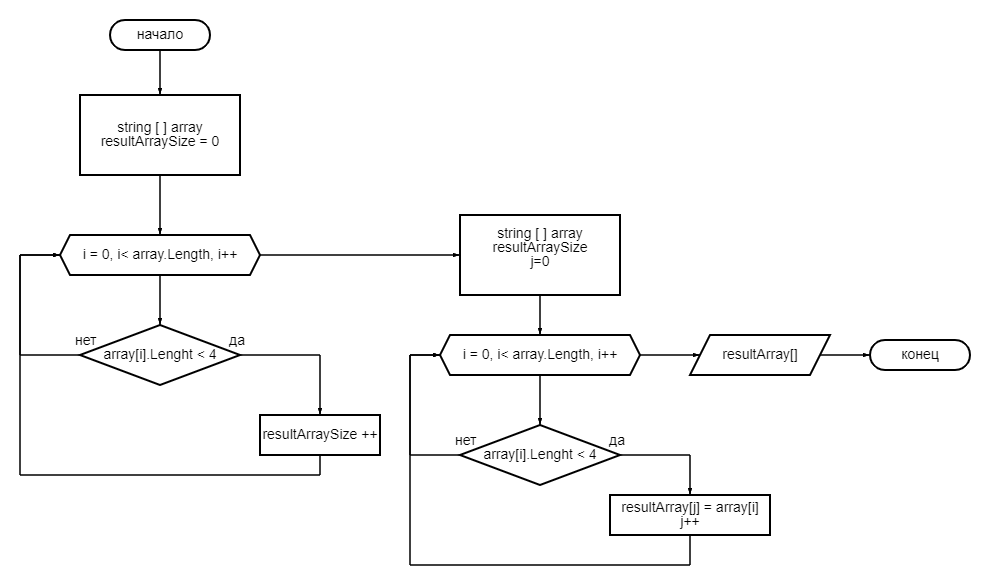

# Решение
## Задача

*Написать программу, которая из имеющегося массива строк формирует массив из строк, длина которых меньше либо равна 3 символа. Первоначальный массив можно ввести с клавиатуры, либо задать на старте выполнения алгоритма. При решении не рекомендуется пользоваться коллекциями, лучше обойтись исключительно массивами*

## Описание алгоритма

1. В первом методе находим длину массива, который у нас должен получиться. Задаём счетчик resultArraySize = 0, длину каждой строки в первоначальном массиве проверяем меньше ли 4, если да, то счетчик увеличиваем на единицу.
2. Во втором методе входящие данные первоначальный массив и длина, которую мы нашли в первом методе. Создаем новый (результирующий) массив строк с длиной, которую нашли в первом методе. 
В первоначальном массиве проверяем длину каждой строки. Если она меньше 4х, то записываем значение в результирующий массив. 
3. Третий метод выводит на печать получившийся массив.